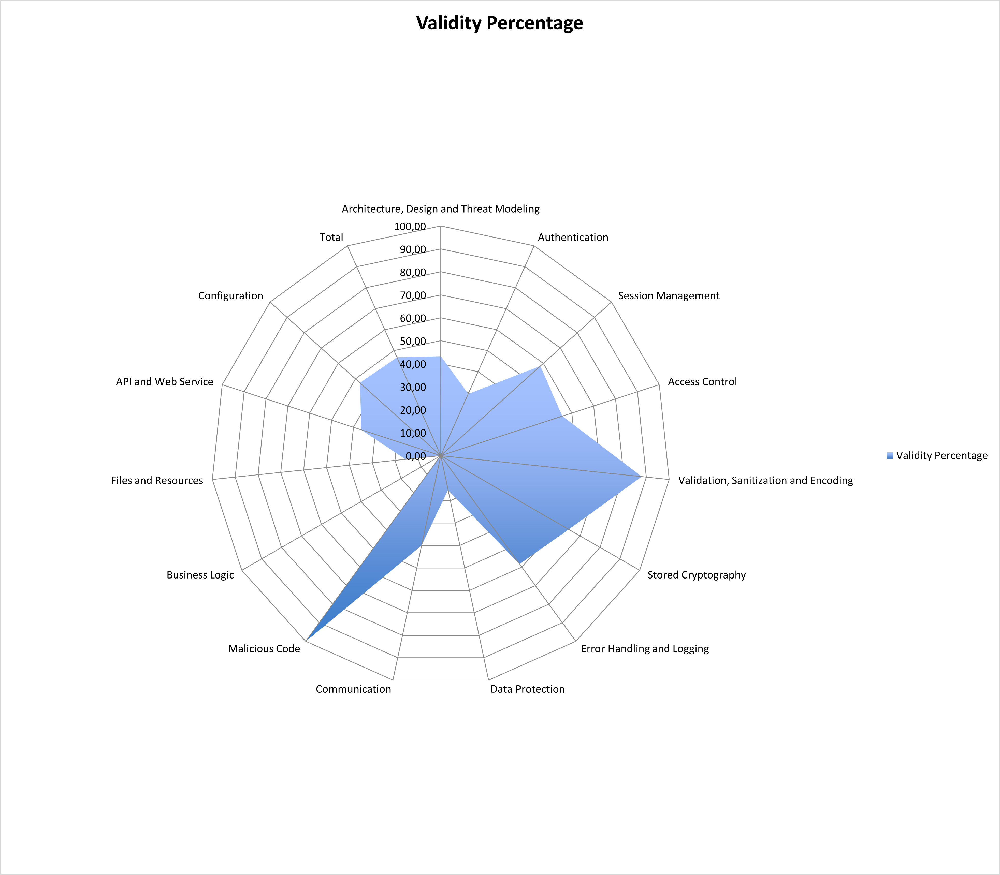

### **Sprint 2 Delivery Report**

This report summarizes the work completed during the second sprint of Phase 2, focusing on the implementation of automated pipelines and the results from the OWASP Application Security Verification Standard (ASVS) checklist.

---

### **Implemented Pipelines**

For this phase of the project, the focus was on automating the development, testing, and deployment processes to enhance security and efficiency. The evaluation criteria for this sprint emphasized the automation of several key practices:

* **Continuous Integration/Continuous Deployment (CI/CD):** The project required the implementation of a DevSecOps pipeline. The goal was to automate builds, testing (including static and dynamic analysis), and security scanning to ensure that the developed functionalities were delivered in a secure and automated fashion.
* **Automated Security Scanning:** The pipeline incorporated several types of automated security analysis:
    * **Static Application Security Testing (SAST):** To analyze source code for potential vulnerabilities.
    * **Software Composition Analysis (SCA):** To identify vulnerabilities in third-party components and libraries.
    * **Dynamic Application Security Testing (DAST):** To test the running application for security flaws.
* **Infrastructure and Configuration:** The sprint also included security configuration, installation, and an overall security assessment of the final application.

---

### **ASVS Checklist Results**

The project underwent a security assessment using the OWASP ASVS framework. The overall result showed that **46.79%** of the applicable criteria were met. Below is a summary of the results by category:

| Security Category | Validity Percentage |
| :--- | :--- |
| **Malicious Code** | 100% |
| **Validation, Sanitization and Encoding** | 88% |
| **Stored Cryptography** | 64.29% |
| **Session Management** | 58.33% |
| **Error Handling and Logging** | 58.33% |
| **Access Control** | 55.56% |
| **Configuration** | 47.37% |
| **Architecture, Design and Threat Modeling**| 43.24% |
| **Communication** | 40% |
| **API and Web Service** | 36.36% |
| **Authentication** | 29.41% |
| **Data Protection** | 15.38% |
| **Files and Resources** | 15.38% |
| **Business Logic** | 0% |

The results indicate strong performance in areas like **Malicious Code prevention** and **Input Validation**. However, areas such as **Business Logic**, **Data Protection**, and **Authentication** have significant room for improvement.

---

### **Pull Request Analysis**

